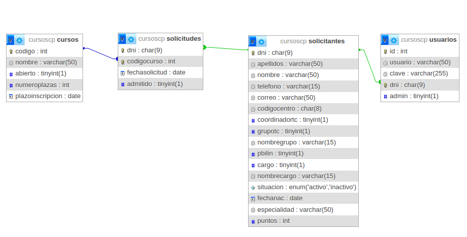
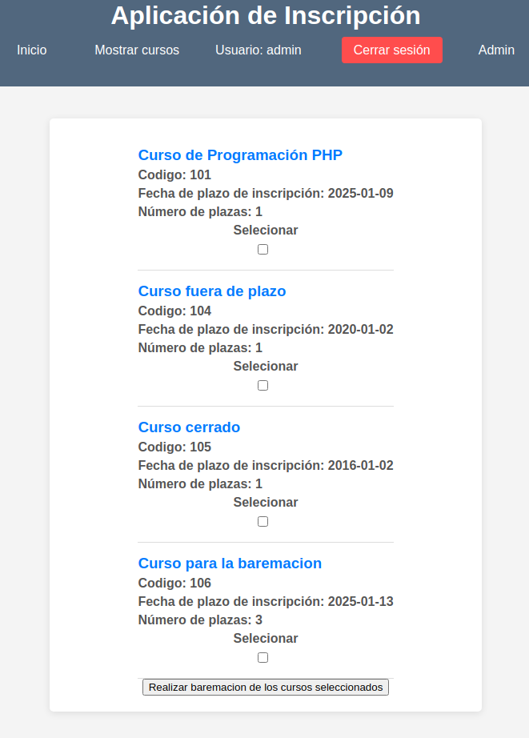

# Inscripción a Cursos de Formación

## Descripción
Este proyecto es una aplicación web desarrollada en PHP que permite gestionar la inscripción de profesores a cursos de formación. La asignación de plazas se realiza de manera automatizada según los méritos de cada solicitante una vez finalizado el plazo de inscripción.

## Tecnologías Utilizadas
- **PHP** para la lógica del servidor.
- **MySQL** como sistema de gestión de base de datos.
- **HTML, CSS y JavaScript** para la interfaz de usuario.

## Base de Datos
La aplicación utiliza una base de datos llamada `cursoscp` con las siguientes tablas:

<div align="center">
  
</div>

## Funcionalidades
- **Autenticación de usuarios**.

<div align="center">
  
</div>

- **Activar/Desactivar cursos** (Administrador).

<div align="center">
  
</div>

- **Realizar inscripción en un curso**.

<div align="center">
  
</div>

- **Baremación automática de solicitantes tras cierre de inscripción** (Administrador).

<div align="center">
  
</div>
  
- **Listar admitidos en un curso** (Administrador).

<div align="center">
  
</div>

- **Añadir/Eliminar cursos** (Administrador).

<div align="center">
  
  
</div>

- **Creacion de pdf para correo de notificacion**.

<div align="center">
  
</div>


## Criterios de Baremación
La asignación de plazas se realiza según los siguientes méritos:

| Mérito | Puntos |
|--------|--------|
| Coordinador TIC | 3 |
| Grupo relacionado con las TICs | 3 |
| Programa bilingüe | 3 |
| Cargo de director | 1 |
| Cargo de Jefe de Estudios | 1 |
| Cargo de Secretario | 1 |
| Cargo de Jefe de Departamento | 1 |
| Antigüedad | 15 |
| Profesor en activo | 3 |

## Instalación y Configuración
1. Clonar este repositorio:
   ```bash
   git clone https://github.com/sam324sam/inscripcion-cursos.git
   ```
2. Configurar el servidor web con PHP y MySQL.
3. Importar la base de datos desde `cursoscp.sql`.
4. Configurar las credenciales de la base de datos en `db.php`.
5. Descargar la librería de **PHP Mailer**: [PHPMailer en GitHub](https://github.com/PHPMailer/PHPMailer)
6. Descargar la librería **Fpdf186 v1.86**: [FPDF](http://www.fpdf.org/)
7. Instalacion de un servidor mail En este caso El servidor Axigen [Axigen]([http://www.fpdf.org/](https://www.axigen.com/mail-server/download/))
8. Ejecutar la aplicación desde el navegador.

## Autor
Este proyecto ha sido desarrollado por Samuel Moniz Pereira.

## Licencia
Este proyecto se distribuye bajo la licencia MIT.

